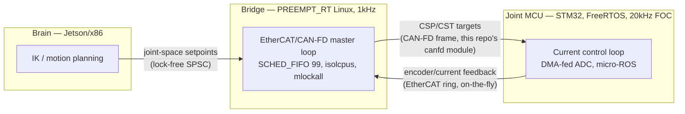

# RealTime_ring_buffer_IPC_control
# Lock-Free Real-Time IPC — Brain / Bridge / Joint-MCU

Two side-by-side implementations — **Rust** and **C++** — of the same
question, for a 3-tier humanoid-robotics control architecture:

> **Brain** (Jetson/x86, AI + IK) → **Bridge** (PREEMPT_RT Linux, 1kHz
> EtherCAT/CAN-FD master) → **Joint MCU** (STM32, FreeRTOS, 20kHz FOC)

Each tier hand-off is built and benchmarked two ways — "the usual implementation"
(a lock-based channel or a TCP/REST-style socket) versus a lock-free,
cache-aware design — with real, reproducible numbers, not just claims.



## Repo layout

```
rust/   rtrb + heapless::spsc demos, plus a unit-tested CAN-FD framing module
cpp/    hand-rolled lock-free shared-memory ring buffer + cache-layout demos
docs/   diagrams, and first-person interview notes on the design decisions
```

- **[`rust/`](rust/)** — `rtrb` (Brain↔Bridge) and `heapless::spsc`
  (ISR↔main-loop, Joint MCU tier) lock-free SPSC demos, a `std::sync::mpsc`
  baseline for comparison, and `src/canfd.rs`: a unit-tested CAN-FD wire
  framing module (explicit byte layout, CRC-8, round-trip + corruption
  tests — `cargo test`).
- **[`cpp/`](cpp/)** — the same lock-free-vs-lock-based comparison at the
  Brain tier: a hand-rolled SPSC ring buffer in POSIX shared memory vs. a
  TCP loopback socket, plus a standalone benchmark isolating cache-line
  false sharing (`alignas(64)` vs. not).


## The comparison, side by side

| | "Usual way" | This repo's approach | Where |
|---|---|---|---|
| Brain → Bridge (Rust) | `std::sync::mpsc` (mutex/condvar) | `rtrb` — wait-free SPSC ring buffer | `rust/src/bin/channel_baseline.rs` vs `rtrb_bridge.rs` |
| Brain → Bridge (C++) | TCP loopback socket (REST-style hop) | hand-rolled lock-free SPSC ring buffer in shared memory (`shm_open`+`mmap`) | `cpp/src/naive_tcp_ipc.cpp` vs `lockfree_shm_ipc.cpp` |
| Joint state layout | Array-of-Structs (`JointStateAoS[7]`) | Struct-of-Arrays, cache-line padded (`JointStateSoAPadded`) | `cpp/src/common.hpp` |
| ISR ↔ main loop (MCU tier) | n/a (would typically be a mutex-guarded global) | `heapless::spsc::Queue` — `no_std`, static allocation | `rust/src/bin/heapless_spsc_mcu.rs` |
| Bridge → MCU wire format | n/a | explicit CAN-FD frame layout + CRC-8, unit-tested | `rust/src/canfd.rs` |

### Why "lock-free" beats a channel/socket here

A `Mutex`+`Condvar`-based channel (or a TCP socket, which is the same class
of kernel-mediated hop) has two properties a 1kHz/20kHz hard-real-time
consumer can't tolerate:

1. **Priority inversion** — if the low-priority producer is preempted while
   holding the internal lock, the high-priority consumer can be made to
   wait on a thread the scheduler isn't even running. (This is the same
   failure class that caused the Mars Pathfinder watchdog resets.)
2. **Non-deterministic latency** — a futex wake or a socket round trip can
   involve a syscall and a context switch: a variable-cost operation inside
   a loop with a fixed deadline.

`rtrb`, `heapless::spsc`, and the hand-rolled C++ ring buffer are all
**wait-free SPSC**: two padded atomic indices, a fixed preallocated buffer,
`Acquire`/`Release` ordering, no lock, no syscall, no heap allocation on the
hot path. Full design rationale (capacity sizing, overflow policy, and why
a *triple buffer* is arguably even more correct than a queue for
"latest-value" state like a setpoint) is in `rust/README.md`'s equivalent
section — see the code comments in each `*_bridge.rs`/`*_ipc.cpp` file.

### Cache layout: why AoS → SoA matters independently of locking


Modern CPUs fetch memory in 64-byte lines. An Array-of-Structs layout gives
you no control over which joints share a line — Joint 0 (Brain writes) and
Joint 1 (Bridge reads) very likely land on the same one, so every Brain
write invalidates the Bridge core's cached copy: **false sharing**, costing
a cache-coherence round trip on every write even though the two threads
never touch each other's actual data. Struct-of-Arrays with each field
padded to a cache-line multiple removes that hazard *and* gets a linear,
prefetcher-friendly scan when the Bridge reads all 7 positions for the
EtherCAT frame.

## Measured results

Real numbers from `cargo run --release` / `make run`, not estimates.
**Read floor (min/mean) as the mechanism cost; read tail (p99/max) with the
environment caveat below.**

| Benchmark | min | mean | p99 | max |
|---|---|---|---|---|
| Rust: `rtrb` (Brain→Bridge) | 3.4µs | 72.8µs | 138µs | 145µs |
| Rust: `std::sync::mpsc` baseline | 1.9µs | 260µs | 705µs | 715µs |
| C++: TCP loopback (AoS) | 6.4µs | 7.1µs | 18µs | 41µs |
| C++: lock-free shared memory (SoA) | 1.8µs | 27.5µs | 155µs | 203µs |
| C++: false sharing, unpadded vs `alignas(64)` | — | 1.01x (see caveat) | — | — |

> **Environment caveat, stated plainly:** all of the above were measured on
> a shared, single-core, non-RT sandbox — not the target PREEMPT_RT/isolated-
> core hardware this architecture describes. That specifically flattens the
> false-sharing ratio (needs ≥2 physical cores to manifest at all; expect
> 2–5x on real multi-core hardware) and inflates the shared-memory demo's
> *tail* latency (two processes contending for one core is exactly the
> scheduling noise `isolcpus`+`SCHED_FIFO` priority 99 exists to remove).
> The **floor** numbers — where lock-free beats lock-based by 2–3.5x even in
> this unfavorable environment — are the reproducible, honest part of this
> comparison. `docs/interview-notes.md` walks through exactly what each
> number does and doesn't prove, and what change on real hardware.

## Building and testing

```bash
# Rust
cd rust && cargo build --release && cargo test && cargo clippy --all-targets

# C++
cd cpp && make all

# Both, reproducibly, via Docker
docker build -t rt-motion-ipc .
docker run --rm rt-motion-ipc
```

CI (`.github/workflows/ci.yml`) runs `cargo fmt`/`clippy`/`test` and the
C++ build + smoke run on every push — see the badge above (replace the
placeholder `<your-github-username>/<your-repo-name>` once this is pushed).

## What this repo does *not* claim

In the interest of not overselling a sandboxed demo: there is no physical
CAN transceiver here, so `rust/src/canfd.rs` is wire-framing logic
(byte layout, CRC), not a register-level peripheral driver. There's no real
FreeRTOS target, isolated core, or `PREEMPT_RT` kernel in CI or in the
container above — the design decisions that depend on those (task
priorities, `mlockall`, `isolcpus`) are documented and reasoned about in
`docs/interview-notes.md`, not benchmarked on real hardware here. Being
explicit about that boundary is itself part of the point: knowing which
numbers are load-bearing and which are illustrative is the actual skill
being demonstrated.
